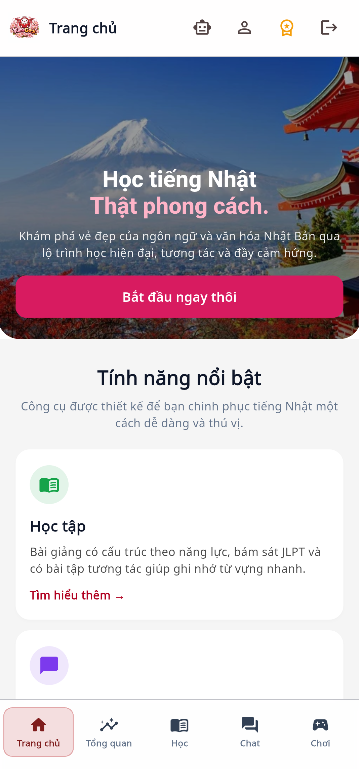
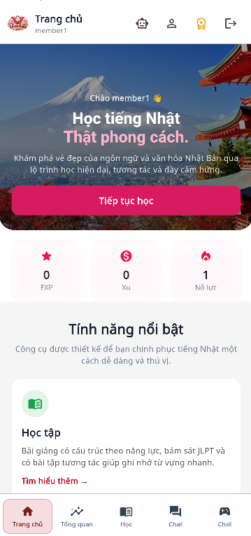
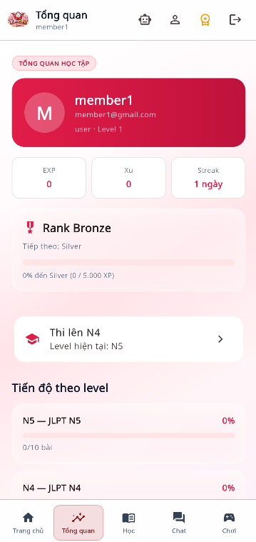
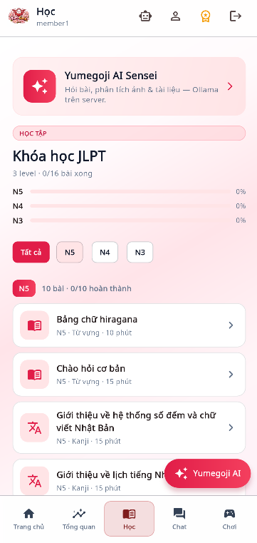
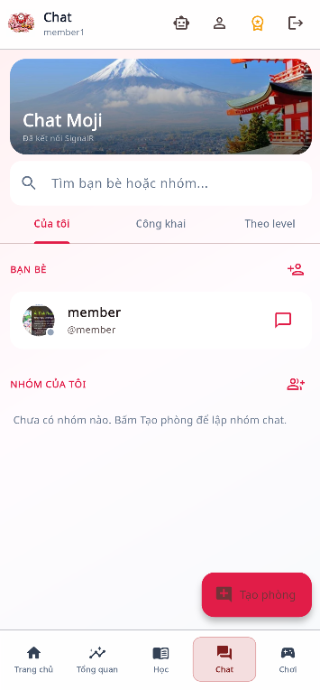

# EXE201App — YumeGo-Ji (monorepo)

Repo gồm **API backend** (.NET 8) và **app mobile** (Flutter), dùng chung hệ thống EXE201.

```
EXE201App/
├── backend/          # ASP.NET Core API — http://localhost:5056
├── mobile/           # Flutter app
├── docs/screenshots/ # Ảnh màn hình app (README)
├── scripts/          # Tiện ích DB / bài học (Supabase) — tùy chọn
└── README.md
```

## Giao diện app (screenshots)

### Đăng nhập & Trang chủ

| Trang chủ (khách) | Đăng nhập | Trang chủ (đã đăng nhập) |
|:---:|:---:|:---:|
|  |  |  |

### Các màn chính

| Tổng quan | Học | Chat | Chơi (Game) |
|:---:|:---:|:---:|:---:|
|  |  |  |  |

## 1. Backend

### Cấu hình lần đầu

```powershell
cd backend
copy appsettings.Secrets.example.json appsettings.Secrets.json
# Sửa ConnectionStrings:DefaultConnection → Supabase PostgreSQL (xem backend/SUPABASE-CAU-HINH.txt)
dotnet restore
dotnet run --launch-profile http
```

API mặc định: **http://localhost:5056** (`Properties/launchSettings.json`, profile `http`).

### Database (Supabase PostgreSQL)

1. Tạo project trên [Supabase](https://supabase.com).
2. Chạy schema: `backend/doc/sql/yumegoji_supabase.sql`
3. Seed dữ liệu (theo thứ tự trong `backend/doc/sql/yumegoji_supabase_data_v2_parts/00_README.txt`).
4. Bổ sung bài N3 (nếu cần): `.\scripts\apply-n3-lessons.ps1` (cần `appsettings.Secrets.json`).

Script SQL Server cũ vẫn nằm trong `backend/doc/sql/` (DDL/seed) nếu team dùng SQL Server local.

**Không commit** `appsettings.Secrets.json` (đã có trong `.gitignore`).

## 2. Mobile (Flutter)

Cần [Flutter SDK](https://docs.flutter.dev/get-started/install) trong `PATH`.

```powershell
cd mobile
flutter pub get
flutter run
```

| Thiết bị | API mặc định |
|----------|----------------|
| Android Emulator | `http://10.0.2.2:5056` |
| Máy thật (cùng Wi‑Fi) | `flutter run --dart-define=API_BASE_URL=http://<IP-PC>:5056` |

Đăng nhập Google (tùy chọn):

```powershell
flutter run --dart-define=GOOGLE_SERVER_CLIENT_ID=xxx.apps.googleusercontent.com
```

### Build APK (release)

```powershell
cd E:\FPT\PRM393\YumeGoJAPP
.\build-apk.ps1
# Máy thật: .\build-apk.ps1 -ApiUrl "http://<IP-PC>:5056"
```

File ra: `YumeGo-Ji-release.apk` (thư mục gốc repo).

## 3. Thứ tự chạy khi dev

1. Cấu hình Supabase + `appsettings.Secrets.json`.
2. `cd backend` → `dotnet run --launch-profile http`.
3. `cd mobile` → `flutter run`.

## 4. Thư mục `scripts/` (tùy chọn)

Dùng khi cần đồng bộ / kiểm tra dữ liệu bài học trên Supabase (không bắt buộc để chạy app):

| Script | Mục đích |
|--------|----------|
| `sync-lessons-to-supabase.ps1` | Đồng bộ bảng lesson từ SQL mẫu |
| `apply-n3-lessons.ps1` | Thêm / cập nhật bài học JLPT N3 |
| `check-lessons.ps1` | Kiểm tra bài publish theo level |
| `dump-lesson.ps1` | Xuất nội dung một bài (debug) |

## 5. So với EXE201 Web

- **Web**: frontend + backend (repo khác).
- **Repo này**: backend API + **client Flutter** — API tương thích Web (cùng cổng 5056).
